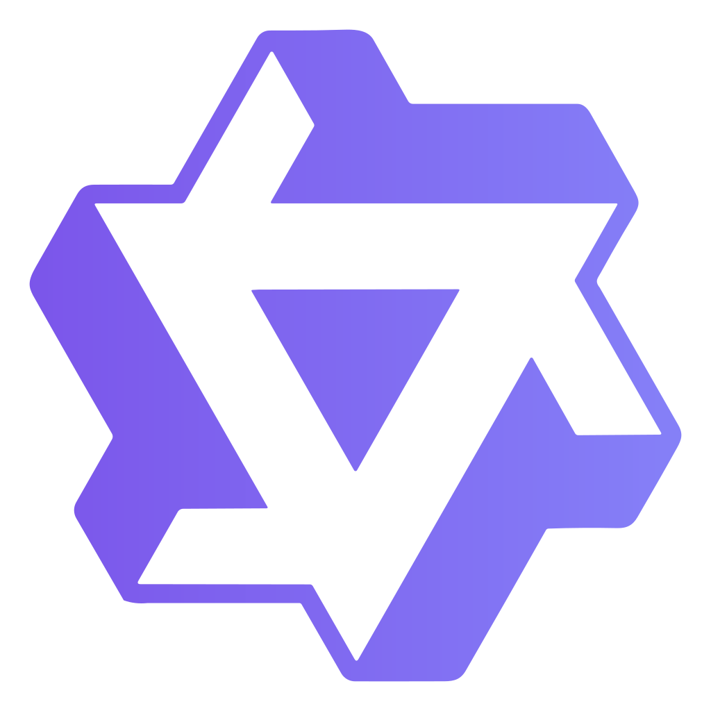
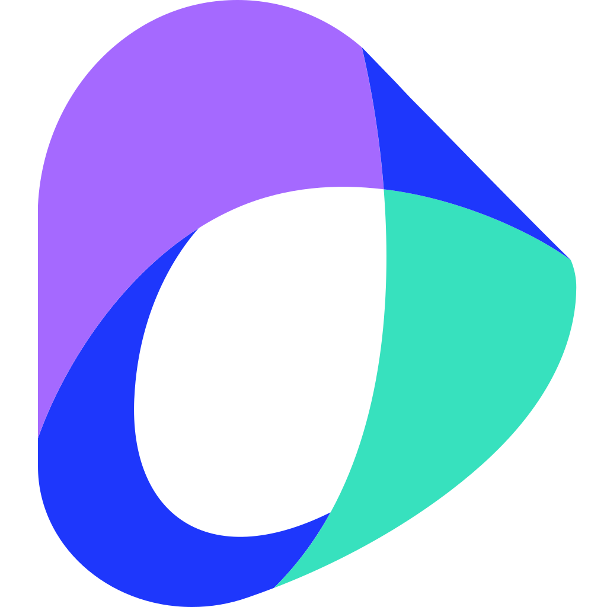

  <!-- dynamic typing effect 动态打字效果 -->
  

    
  

  <!-- knock code pictures 敲代码的图片 -->
  <picture>
    <source media="(prefers-color-scheme: dark)" srcset="https://raw.githubusercontent.com/buptsdz/buptsdz/main/assets/images/coding.gif" />
    <source media="(prefers-color-scheme: light)" srcset="https://raw.githubusercontent.com/buptsdz/buptsdz/main/assets/images/developer.svg" />
    
  </picture>

  <!-- for beauty 留个空行好看点 -->
  
&nbsp;

  
  <!-- profile logo 个人资料徽标 -->
  

    &emsp;
    &emsp;
    &emsp;
    &emsp;
    &emsp;
    &emsp;
    <!-- visitor -->
    &emsp;
    <!-- wakatime -->
    <!--  -->
  

  
  <!-- 活跃贪吃蛇 -->
  <picture>
    <source media="(prefers-color-scheme: dark)" srcset="https://raw.githubusercontent.com/buptsdz/buptsdz/output/github-contribution-grid-snake-dark.svg">
    <source media="(prefers-color-scheme: light)" srcset="https://raw.githubusercontent.com/buptsdz/buptsdz/output/github-contribution-grid-snake.svg">
    
  </picture>
  
  <!-- 个人信息统计 -->
  
  
  
  
  <!-- 活跃折线图 -->
  <!-- <picture>
  <source media="(prefers-color-scheme: dark)" srcset="https://github-readme-activity-graph.vercel.app/graph?username=buptsdz&theme=xcode&bg_color=FF000000&hide_border=true" />
  <source media="(prefers-color-scheme: light)" srcset="https://github-readme-activity-graph.vercel.app/graph?username=buptsdz&theme=xcode&bg_color=FF000000&color=000000&hide_border=true" />
  
  </picture> -->
  
  <!-- 
&nbsp;
 -->
  
  <!-- GitHub 奖杯🏆 -->
  <!-- 
 
 -->

&nbsp;

# Hello 👋, here is Sue ~

<table>
<!-- 个人介绍 -->
<tr><td>

### 🤺 About Me

就读于**复旦大学**智能复杂体系实验室，目前博一，多模态大模型基座研究方向，本科北邮通信

- 🌱 目前的研究方向是多模态大模型研究，以及多智能体的策略模拟。

- 🛠️ 热爱计算机科学和 IT 互联网 🖥️，平时自己也做一些**全栈开发**，希望能成为一名优秀的开发者。

- 💰 同时自己也接一些**软件开发**的单子，已高质量服务**30 余**大小客户。
- 💩 我的作品 ⏬⏬
  - <a href="http://games.sparkflare.cn" target="_blank">>>网页小游戏</a>

  - <a href="http://sue.sparkflare.cn" target="_blank">>>个人博客</a>

  - <a href="http://www.sparkflare.cn" target="_blank">>>数据标注平台（项目重启中...）</a>

- ✨ 我在语雀文档平台上记录我的学习和爱好 🔜<a href="https://www.yuque.com/u39067637" target="_blank">语雀·史迪仔</a>

- 🤔 我是一个终身学习者，对编程、人工智能、数据科学充满热情。

- 👥 2024 年初和朋友创业，是关于数据方向的，有兴趣的朋友可以来看看 <a href="http://www.sparkflare.cn" target="_blank">▶️Sparkflare</a>

- 🔎 爱好古玩收藏，我的一些藏品：http://sue.sparkflare.cn/views/antique-collection.html

&emsp;&emsp;Go be a great engineer. We're making the world a better place. Through constructing elegant hierarchies for maximum code reuse and extensibility.
</tr>

<!-- 就读经历 -->
<tr><td>

### 🏢 Study Experience

- [复旦大学](https://www.fdu.edu.cn/) &emsp; 📌 2025-09 —— 至今
  - 学院：智能复杂体系基础理论与关键技术实验室
  - 研究方向：多模态大模型 and 多智能体模拟
  
&nbsp;

- [北京邮电大学](https://www.bupt.edu.cn/) &emsp; 📌 2021-09 —— 2025.7
  - 学院：信息与通信工程学院
  - 专业：通信工程（英才班）

&nbsp;

</td></tr>

<!-- 工作经历 -->
<tr><td>

### 🏭 Work Experience

- [中国电信人工智能研究院](http://www.chinatelecom.com.cn/) &emsp; 📌 2025-3 —— 至今
  - 工作岗位：多模态大模型实习生
  - 工作内容：多模态大模型的训练（微调），推理，测评，数据构造，打榜以及实际应用

&nbsp;

- [中国电信人工智能研究院](http://www.chinatelecom.com.cn/) &emsp; 📌 2024-11 —— 2025-3
  - 工作岗位：智能感知与识别实习生
  - 工作内容：在电诈识别领域，使用机器学习进行不平衡多维度数据的分类

&nbsp;

&nbsp;

- [上海人工智能实验室](https://www.shlab.org.cn/) &emsp; 📌 2024-06 —— 2024-11
  - 工作岗位：AI4Science 大模型实习生
  - 工作内容：数据处理和构造，大模型推理，测评，RAG的研究和应用

&nbsp;

- [Sparkflare](http://www.sparkflare.cn/) &emsp; 📌 2024-01 —— 2025.7
  - 工作岗位：全栈开发，ai系统设计
  - 工作内容：数据标注软件平台开发，探索基于AI agent范式的知识驱动标注系统；获得 24 年互联网+国家银奖

&nbsp;

<!--

- [众艺鑫团队](https://mp.weixin.qq.com/s/isj3AT4irFgKDtVh550P4Q) &emsp; 📌 2024-01 —— 2024.03
  - 工作岗位：前端开发工程师
  - 工作内容：数字化知识交互学习软件开发，uniapp+vue

&nbsp;

- [Unionswap](http://www.unionswap.cn/) &emsp; 📌 2023-10 —— 2024.4
  - 工作岗位：前端开发实习生
  - 工作内容：海外二手交易平台开发，uniapp+vue
-->

&nbsp;

</td></tr>
</table>

## 🧰 Tech Stack:

### most commonly used

<!--  skill badge 技能徽章 -->

  
  
  

### most commonly used AI

  <!-- png静态图 -->
  
  
  
   

&nbsp;

### others

      

     

  <!-- svg动图 -->
  
   
    
  
  
  
  
  <!-- svg静态图 -->
  

<!-- Gif -->

  
  
  
  
  

## github-readme-streak-stats

<!-- github-readme-streak-stats 连续提交代码天数记录 -->

    <!--  -->
    <picture>
      <source aligh="center" media="(prefers-color-scheme: dark)" srcset="https://github-readme-streak-stats.herokuapp.com/?user=buptsdz&theme=dark&hide_border=true" />
      <source aligh="center" media="(prefers-color-scheme: light)" srcset="https://github-readme-streak-stats.herokuapp.com/?user=buptsdz&theme=light&hide_border=true" />
      
    </picture>
    <!--  -->
    
&nbsp;

    <!-- metrics -->
    <!--  -->
    
    <!--  -->

<!-- profile-3d-contrib 3D 贡献图-->
<picture>
  <source media="(prefers-color-scheme: dark)" srcset="https://cdn.jsdelivr.net/gh/buptsdz/buptsdz/profile-3d-contrib/profile-night-rainbow.svg" />
  <source media="(prefers-color-scheme: light)" srcset="https://cdn.jsdelivr.net/gh/buptsdz/buptsdz/profile-3d-contrib/profile-gitblock.svg" />
  
</picture>

  

<!--
**buptsdz/buptsdz** is a ✨ _special_ ✨ repository because its `README.md` (this file) appears on your GitHub profile.

Here are some ideas to get you started:

- 🔭 I’m currently working on ...
- 🌱 I’m currently learning ...
- 👯 I’m looking to collaborate on ...
- 🤔 I’m looking for help with ...
- 💬 Ask me about ...
- 📫 How to reach me: ...
- 😄 Pronouns: ...
- ⚡ Fun fact: ...
-->
